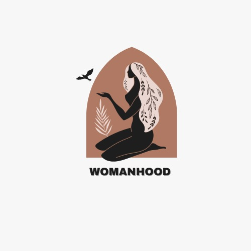

## Submission for ACCESS-DENIED

[](https://github.com/Srish-tii/) [](https://github.com/Srish-tii/) [](https://github.com/Srish-tii/.../stargazers)

<p align="center">
<a href="">

</a>
</p>

# WOMANHOOD - Your health is an investment not an expense

## Team name - Beryllium

## Team-Members:

- [Yasharth Tripathi](https://github.com/yasharthratan)
- [Srishti Lodha](https://github.com/Srish-tii)
- [Kartik Khanna](https://github.com/kartik0406)
- [Harsh Malani](https://github.com/Harsh-1309)
- [Aarushi Shrestha](https://github.com/Aarushi21)


## Tracks Chosen - HEALTHCTECH | OPEN INNOVATION

## Problem Statement

There is a lot of fear of the stigma associated with reproductive health services, women often avoid making use of such services. This stigma imposes a great deal of mental stress, fear, and depression on patients and causes delays in the diagnosis and treatment of their conditions. The importance of womenhealth is not just very low on priority, but overlooked at a level that there is alot of delay for diagonsis of even severe health issues such as PCOS and breast cancer, leave aside the loads of generic diseases. Women should never feel ashamed about their health concerns whether that be their periods, reproductive health, menopause or something else.

## Our solution

Through Womanhood, we aim at solving this barrier for women to connect with doctor and try to reduce the errors and hassle in the diagnosis of the ailments. Womanhood is an initiative through which we want to build an all-in-one women health platform, which diagnoses alot of issues, especially women specific ones and help raise awareness for its treatment and management. The details have been given in the features.


## Features

* <b>Predict PCOS</b> using AI in a person on the basis of their lifestyle and history.
* <b>Convey general information about diseases that women are prone to and importance of women healthcare</b>
* <b>Run a general diagnosis for the user based on the symptoms she enters. </b>
* <b>Breast Cancer Detection tool :</b> Detects the presence of Metastatic Tissue and Invasive Ductal Carcinoma using two AI Models. 
* Dedicated Dashboard for Patient and Doctor
* Tracking of previous Prescription & Medical History 
* Menstrual Cycle Tracker
* Booking Lab/Appointment
* Video Conferencing for expert consultancy


## Technology Stack

- Machine Learning
  - Python 
  - Scikit-learn, Pandas, NumPy
  - TensorFlow, Keras, NLTK, OpenCV 
  - Matplotlib
  - Node.js (endpoint integration)
  


- Frontend
  - HTML
  - CSS
  - Bootstrap
  
- Backend
  - PHP 
  - MySQL (Database)
  - Node.js

- Tools
  
  - Xampp
  - Git
  - Github

## Instructions to Install and Setup:

- Download and Install Xampp using link  :- https://www.apachefriends.org/download.html
- Download the Zip or clone the repository using command : -
  ``` bash
  git clone https://github.com/Harsh-1309/woman-hood.git
  ```
- Go to the directory where Xampp is installed. For eg. C:\xampp\htdocs
- Copy the project folder and paste it in the address mentioned above.
- Open PhpMyAdmin, create a database named 'Womanhood' and import the womanhood.sql file from the db folder present in the repo.
- Launch any browser window and search localhost/Womanhood.

### Screenshots


.PNG)

.PNG)

.PNG)

.PNG)

.PNG)

.PNG)
---------

```javascript

if (you Loved Our Project) {
    starThisRepository();
}

```

-----------
